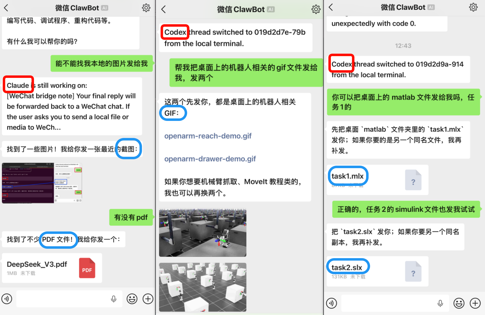

# CLI WeChat Bridge 

**命令行工具的微信桥接**：本项目用于桥接微信消息与本地运行的 [`Codex`](https://github.com/openai/codex)、[`Claude Code`](https://code.claude.com/docs/en/overview) 或持久化 `powershell.exe` 会话，并将本地输出、审批请求与运行状态同步回微信。

当前实现以本地工作流为中心展开，重点是保留本地原生终端体验，并在此基础上提供微信侧的远程输入、结果回流与状态同步能力。

## 这个项目解决什么问题

本项目面向这样一类使用场景：

- 你的主工作流仍在本地终端中进行
- 你希望继续使用原生 `codex` 或其他 CLI 工具，而不是迁移到网页或托管机器人
- 你希望在离开电脑时，仍能通过微信向本地会话发送请求，并接收必要的输出、与状态同步

当前项目并不试图把微信变成新的主工作界面。相反，它的定位是：

- 本地 CLI 仍然是主工作界面
- 微信是远程入口，允许远程接入
- 会话一致性、线程状态和审批流仍以**本地会话为中心**

## 快速开始

### 环境要求

- Windows 为当前主要验证环境
- [Node.js](https://nodejs.org/en/download) `>= 24.0.0`（建议直接安装官网 LTS 版本）
- [Bun](https://bun.sh/docs/installation) `>= 1.0.0`
- 已安装以下至少一种本地 CLI：（最好更新至最新版本）
  - [Codex](https://github.com/openai/codex) 
  - [Claude Code](https://code.claude.com/docs/en/overview)
  - powershell.exe


### 1. 克隆仓库并安装依赖

```bash
git clone https://github.com/UNLINEARITY/CLI-WeChat-Bridge
cd CLI-WeChat-Bridge
bun install
```

### 2. 安装全局命令

如果你希望在任意目录直接使用本项目：

```bash
npm install -g . #将命令下载到全局
```

如果仓库更新，可以重新clone，而本地留有旧配置，再强制更新：

```bash
npm install -g . --force # 强制清除旧配置
```

开发阶段也可以使用：

```bash
npm link
```

说明：

- `npm link` 会让全局命令直接指向当前仓库源码
- `npm install -g .` 会安装一份当前仓库的复制版本；后续代码更新后需要重新执行一次

### 3. 完成微信登录

> 在 clone 的仓库目录下：

```bash
bun run setup # 绑定微信 ClawBot
```

该流程会：

1. 获取微信登录二维码
2. 选择 y 确认，在终端打印二维码
3. 等待你在微信中扫码并确认
4. 将 bot 凭据写入本地数据目录


默认凭据文件路径：

```text
~/.claude/channels/wechat/account.json
```

### 4. 启动 `codex` 模式

假设你的项目目录是：

```bash
cd D:\work\your-project
```
> 当你下载到全局`npm install -g .`后，可以在任意的路径运行桥接！


终端 A：（这是用于监听和服务的，先打开这个）

```bash
wechat-bridge-codex
```


终端 B：（再新开一个窗口,运行以下命令，近乎原生的codex，不过暂时没有实现远程请求确认，待完善)

```bash
wechat-codex
```


然后即可：（允许双向交互！windows 和 linux 均实测成功）

- 在微信中发送普通文本
- 在本地 `wechat-codex` 中继续原生交互
- 在本地执行 `/resume` 切线程
- 让微信自动跟随当前本地线程


如果你希望用**单命令入口**快速启动，也可以直接使用：（仅需打开一个终端）

```bash
wechat-codex-start
```

它会自动完成以下动作：

1. 复用当前目录已运行的 `wechat-bridge-codex`
2. 如果 bridge 正在服务其他目录，则停止旧 bridge 并切换到当前目录
3. 等待当前目录对应的本地 companion endpoint 就绪
4. 打开可见的 `wechat-codex` 会话

`wechat-codex-start` 现在按**单活工作区切换器**工作：

- 同一时间只有一个项目与微信对话
- 在当前目录重复执行是幂等的
- 如果当前目录已经有可见 companion 在运行，则不会重复打开第二个窗口
- 在其他目录执行会显式切换活动工作区

### 5. 启动 Claude Code （不走Channels）

与 Codex 类似的，

终端 A：（这是用于监听和服务的，先打开这个）

```bash
wechat-bridge-claude
```

终端 B：（再新开一个窗口,运行以下命令，近乎原生的claude code，并且支持通过微信完成远程审批确认）

```bash
wechat-claude
```

也支持单命令启动：

```bash
wechat-claude-start
```

它会自动在当前目录拉起或复用 `wechat-bridge-claude`，等待 endpoint 就绪后打开可见的 `wechat-claude` companion。


## 适配器支持情况

> 目前支持将本地文件传输至微信




| 适配器 | 当前状态 | 说明 |
| --- | --- | --- |
| `codex` | 已接入 | 双终端模式；本地 panel 为线程权威；微信跟随本地线程 |
| `claude` | 已接入 | 当前采用 `wechat-bridge-claude` + `wechat-claude` 的双终端 companion 模式；会话切换、最终回复与审批元数据已按 Claude session 语义同步 |
| `shell` | 可用 | 持久 `powershell.exe` 会话；高风险命令支持审批 |


## 命令说明

### 推荐全局命令

```bash
wechat-bridge-codex # 开启 Codex 的桥接
wechat-codex # 打开 Codex (原生交互)
wechat-codex-start # 开启 Codex 的桥接的同时， 打开 Codex
wechat-bridge-claude # 开启 Claude Code 的桥接
wechat-claude # 打开 Claude Code (原生交互)
wechat-claude-start # 开启桥接的同时， 打开  Claude Code
wechat-bridge-shell # 终端桥接，headless 进程
```

### 仓库内开发入口

```bash
bun run setup
bun run bridge:codex
bun run codex:panel
bun run codex:start
bun run bridge:claude
bun run claude:companion
bun run claude:start
bun run bridge:shell
bun run bridge:bun -- --adapter codex
bun run test
```

### Bridge CLI 参数

适用于：

- `wechat-bridge-codex`
- `wechat-bridge-claude`
- `wechat-bridge-shell`

示例：

```bash
wechat-bridge-codex --cwd D:\work\my-project
wechat-bridge-claude --profile work
wechat-bridge-shell --cmd pwsh.exe
```

支持参数：

- `--cwd <path>`：指定工作目录
- `--cmd <executable>`：覆盖默认命令
- `--profile <name-or-path>`：向适配器传入 profile

### `wechat-codex-start` 参数

示例：

```bash
wechat-codex-start --cwd D:\work\my-project
wechat-codex-start --profile work
```

支持参数：

- `--cwd <path>`：显式指定 bridge / companion 对应的工作目录
- `--profile <name-or-path>`：转发给后台启动的 `wechat-bridge-codex`
- `--timeout-ms <ms>`：等待当前目录 endpoint 的最长时间，默认 `15000`

行为说明：

- 同目录重复执行：复用当前目录 bridge；如果 companion 已经在线，则直接提示当前工作区已激活，不会重复打开第二个 companion
- 同目录检测到 companion 已连接但 worker 状态异常（如 `stopped` / `error`）时：会自动回收旧 bridge 并重新启动
- 不同目录执行：会停止旧目录的临时 bridge，并切换到新的活动工作区
- 关闭可见 companion 后，后台 `companion_bound` bridge 会一起退出

### `wechat-claude-start` 参数

示例：

```bash
wechat-claude-start --cwd D:\work\my-project
wechat-claude-start --profile work
```

支持参数：

- `--cwd <path>`：显式指定 bridge / companion 对应的工作目录
- `--profile <name-or-path>`：转发给后台启动的 `wechat-bridge-claude`
- `--timeout-ms <ms>`：等待当前目录 endpoint 的最长时间，默认 `15000`

## 微信侧支持的指令

| 指令 | 说明 |
| --- | --- |
| 普通文本 | 发送给当前活动会话 |
| `/status` | 查看 bridge 当前状态 |
| `/stop` | 中断当前任务 |
| `/reset` | 重建当前本地会话 |

## 工作区模型

本项目采用“当前目录即当前工作区”的模型：

- 从哪个目录启动 `wechat-bridge-codex`，哪个目录就是当前工作区
- `wechat-codex` 必须连接同一工作区
- 不同工作区的状态文件相互隔离

当前不是“一个全局守护进程同时管理多个仓库”的架构，而是：

- 单 owner
- 单 bridge
- 单活动工作区

对 `wechat-codex-start` / `wechat-claude-start` 来说，这意味着：

- 它们是**单活工作区切换器**
- 当前目录重复执行是幂等的
- 其他目录重复执行会触发工作区切换，而不是并行多开

## 数据目录与状态文件

默认数据目录：

```text
~/.claude/channels/wechat
```

主要文件如下：

| 路径 | 作用 |
| --- | --- |
| `account.json` | 微信凭据 |
| `sync_buf.txt` | iLink 增量同步游标 |
| `context_tokens.json` | 微信上下文 token 缓存 |
| `bridge.log` | bridge 运行日志 |
| `bridge.lock.json` | bridge 运行锁 |
| `workspaces/<workspace-key>/bridge-state.json` | 当前工作区状态 |
| `workspaces/<workspace-key>/codex-panel-endpoint.json` | 当前工作区 panel endpoint |

### 环境变量

| 变量名 | 说明 |
| --- | --- |
| `WECHAT_ILINK_BASE_URL` | 覆盖默认 iLink API 地址 |
| `CLAUDE_WECHAT_CHANNEL_DATA_DIR` | 覆盖默认数据目录 |

## 版本更新

### 检查更新

运行以下命令检查是否有新版本：

```bash
wechat-check-update
```

该命令会显示：
- 当前安装的版本
- 远程仓库的最新版本
- 如果有更新，会提供详细的更新指引

### 启动时自动检查

当启动 `wechat-bridge` 相关命令时（如 `wechat-bridge-codex`、`wechat-bridge-claude`），程序会自动检查更新（每24小时一次）。

- 自动检查在后台异步执行，不影响启动速度
- 检查结果会被缓存，避免频繁查询
- 如果发现新版本，会在终端显示更新提示

### 版本检查机制

- **查询方式**：使用 `git ls-remote --tags origin` 查询远程仓库版本标签
- **缓存策略**：检查结果缓存在 `~/.claude/channels/wechat/update-check.json`，有效期24小时
- **无 API 限制**：不使用 GitHub API，避免限流问题，可以频繁使用

### 获取最新版本

当提示有新版本时，使用以下命令更新：

```bash
# 进入项目目录
cd CLI-WeChat-Bridge

# 拉取最新代码
git pull

# 安装依赖
bun install

# 重新安装全局命令
npm install -g .
```

### 未来计划（还未发布）

当项目达到 **1.0.0** 稳定版本后，将发布到 npm，届时可以使用更简便的更新方式：

```bash
npm install -g @unlinearity/cli-wechat-bridge@latest
```

## 常见问题

### 1. `wechat-codex` 提示找不到 bridge

通常原因如下：

- 还没有先启动 `wechat-bridge-codex`
- bridge 与 panel 不在同一个目录
- 当前工作区 endpoint 文件不存在

建议：

1. 先在目标目录启动 `wechat-bridge-codex`
2. 再在同一目录启动 `wechat-codex`

如果你不想手动分两个终端，也可以直接执行：

```bash
wechat-codex-start
```

### 2. 全局命令不存在

请确认已经执行以下之一：

```bash
npm install -g .
```

或：

```bash
npm link
```

如果命令仍不存在，请检查 npm 全局 bin 目录是否已加入 `PATH`。

### 3. Windows 下出现 `codex.ps1` 或 PowerShell profile 警告

项目已经尽量规避 `codex.ps1`：

- 优先查找 vendor `codex.exe`
- 必要时通过 `cmd.exe` 包装 `codex.cmd`

如果本机 PowerShell profile 本身受执行策略限制，终端仍可能打印相关警告。这通常不是 bridge 本身故障。

### 4. 微信上提示没有 context token

通常表示当前联系人还没有建立可用的 iLink 上下文。一般先由 owner 账号发送一条普通消息即可建立上下文。

### 5. `codex is still working...`

该提示只应在当前确实存在活动任务时出现。

如果偶发出现：

1. 先确认本地 `wechat-codex` 是否真的仍在执行任务
2. 必要时使用 `/stop`
3. 检查：

```text
~/.claude/channels/wechat/bridge.log
```

### 6. 本地 `/resume` 后微信不同步

请优先确认： `wechat-bridge-codex` 与 `wechat-codex` 是否都已重启到同一版本。

部分设备可能存在第一次本地输入不同步到微信的情况，可以先微信发送指令来建立连接。

## 已知限制

- 微信 `/resume` 暂时被禁用（可能导致对话双向不稳定）
- Codex 不支持底层任务的远程审批！建议给好权限，正常使用，几乎不会主动请求较为低级的远程审批；Claude Code 支持远程审批，但是测试的不够，如有问题可以提 issue。
- 当前模型是单 owner、单 bridge、单活动工作区


## 开发说明

### 主要入口

| 文件 | 作用 |
| --- | --- |
| `src/bridge/wechat-bridge.ts` | bridge 主事件循环 |
| `src/bridge/bridge-adapters.ts` | `codex` / `claude` / `shell` 适配器实现 |
| `src/companion/local-companion.ts` | `wechat-codex` / `wechat-claude` 本地 companion 入口 |
| `src/companion/codex-panel.ts` | Codex panel 入口（备用） |
| `src/companion/codex-panel-link.ts` | bridge 与 Codex panel 的本地 IPC |
| `src/wechat/wechat-transport.ts` | iLink 消息收发 |
| `src/bridge/bridge-state.ts` | bridge 状态、锁与日志 |
| `src/wechat/setup.ts` | 登录与凭据初始化 |

### 测试

```bash
bun test
```

当前测试主要覆盖：

- Windows 启动解析
- Codex 线程跟随
- session log fallback
- panel / busy / completion recovery
- 工作区路径与状态隔离

## 致谢

- [Linux DO](https://linux.do/)：学AI，上L站！

- [openclaw-weixin](https://github.com/hao-ji-xing/openclaw-weixin)：支持Claude Code Channel,感谢如此迅速的开源。

- [@modelcontextprotocol/sdk](https://github.com/modelcontextprotocol/typescript-sdk)：TypeScript 版 MCP SDK

- [node-pty](https://github.com/microsoft/node-pty)：本地 PTY / ConPTY 进程桥接

- [@anthropic-ai/sdk](https://github.com/anthropics/anthropic-sdk-typescript)：Anthropic TypeScript SDK

- [qrcode-terminal](https://github.com/gtanner/qrcode-terminal)：终端二维码输出

## License

[MIT](LICENSE.txt)
